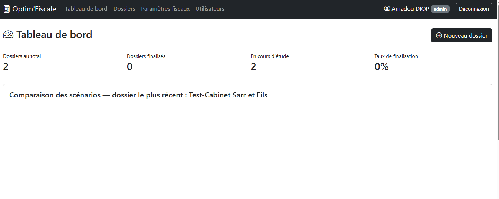
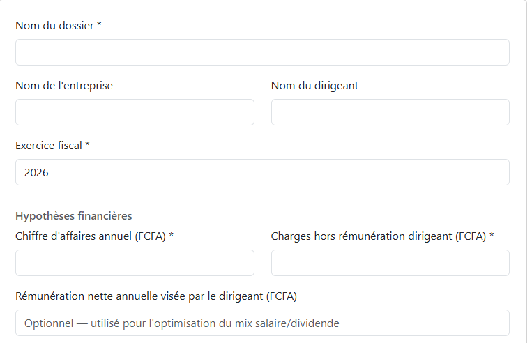
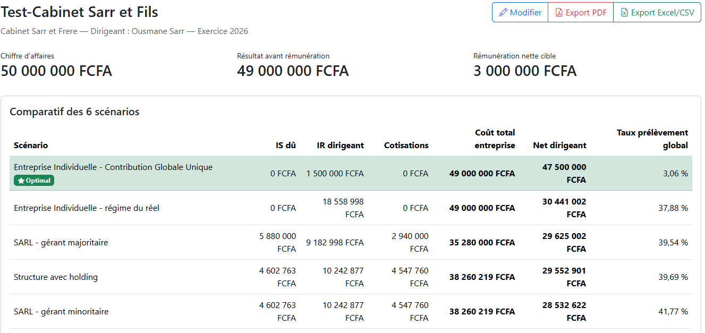
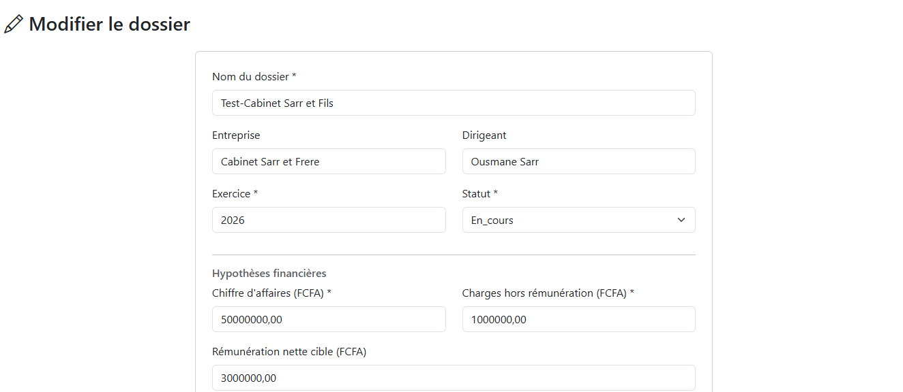
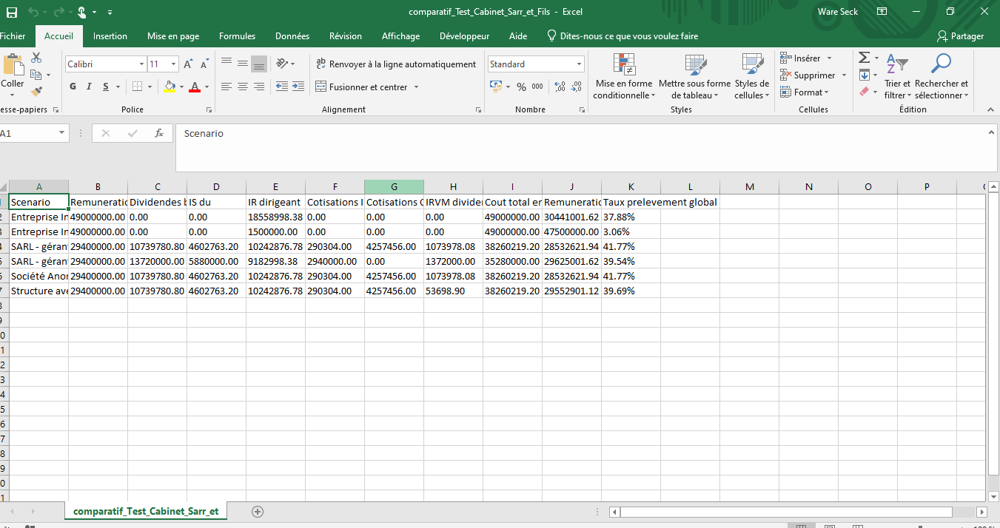
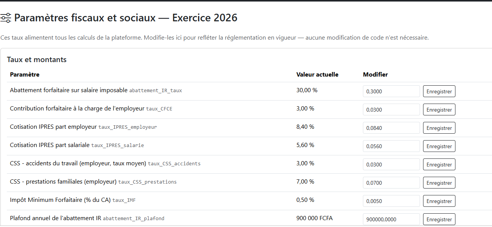
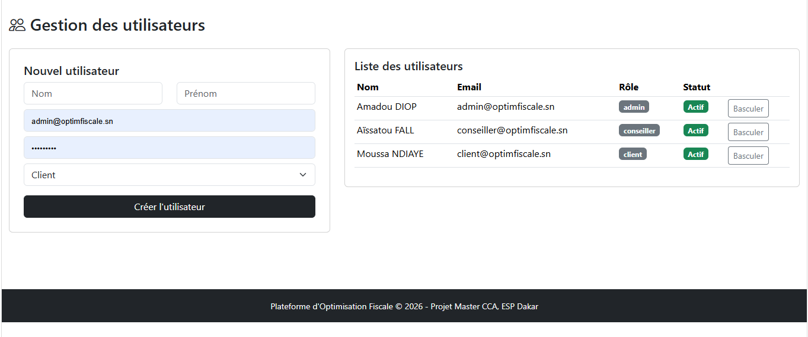

# Manuel utilisateur — Optim'Fiscale

> ⚠️ À compléter : ce document donne la structure attendue (15-20 pages avec captures d'écran).
> Une fois l'application installée et testée en local, remplace chaque section `[CAPTURE D'ÉCRAN ICI]`
> par une vraie capture (touche Impr. écran / Windows+Maj+S / Cmd+Maj+4) et ajuste les textes si
> ton interface diffère légèrement après tes propres tests.

## Sommaire
1. Présentation de la plateforme
2. Connexion et rôles utilisateurs
3. Tableau de bord
4. Créer un nouveau dossier
5. Consulter le comparatif des scénarios
6. Modifier / supprimer un dossier
7. Exporter en PDF et Excel/CSV
8. Administration : paramètres fiscaux
9. Administration : gestion des utilisateurs
10. Sécurité et bonnes pratiques

---

## 1. Présentation de la plateforme
Optim'Fiscale permet de comparer automatiquement 6 scénarios juridiques et fiscaux pour la
rémunération d'un dirigeant, afin d'identifier la structure la plus avantageuse.

## 2. Connexion et rôles utilisateurs

Trois rôles existent :
- **Administrateur** : gère les utilisateurs et les paramètres fiscaux
- **Conseiller** : crée et gère les dossiers de ses clients
- **Client** : consulte ses propres dossiers

## 3. Tableau de bord

Affiche le nombre de dossiers, leur statut, et un graphique de comparaison du dernier dossier créé.

## 4. Créer un nouveau dossier

Étapes :
1. Cliquer sur "Nouveau dossier"
2. Renseigner le nom du dossier, l'entreprise, le dirigeant
3. Saisir le chiffre d'affaires et les charges hors rémunération
4. (Optionnel) indiquer une rémunération nette cible
5. Valider — les 6 scénarios sont calculés automatiquement

## 5. Consulter le comparatif des scénarios

Le scénario optimal (net dirigeant le plus élevé) est surligné en vert.

## 6. Modifier / supprimer un dossier

La suppression est réservée aux administrateurs et est définitive.

## 7. Exporter en PDF et Excel/CSV

Le PDF contient le rapport complet ; le CSV s'ouvre directement dans Excel.

## 8. Administration : paramètres fiscaux

Permet d'ajuster les taux (IS, IPRES, CSS, barème IR...) sans modifier le code.

## 9. Administration : gestion des utilisateurs

Création de comptes conseiller/client, activation/désactivation.

## 10. Sécurité et bonnes pratiques
- Ne jamais partager son mot de passe
- Se déconnecter après chaque session, en particulier sur un poste partagé
- Vérifier régulièrement le journal d'audit (fonctionnalité admin)
